```mermaid
graph TB
    subgraph "Frontend Layer"
        A[📋 Job Listings UI]
        B[🔐 Contract Portal]
        C[⚙️ Admin Dashboard]
    end
    
    subgraph "Data Layer"
        D[📄 jobs-data.json]
        E[👥 freelancers.json]
        F[📊 localStorage/Database]
    end
    
    subgraph "Integration Layer"
        G[📧 EmailJS]
        H[📝 Google Forms]
        I[🖨️ PDF Generation]
    end
    
    subgraph "External Services"
        J[☁️ Email Service]
        K[📊 Form Responses]
        L[💾 File Storage]
    end
    
    A --> D
    B --> E
    C --> D
    C --> E
    C --> F
    
    A --> H
    B --> G
    B --> I
    
    G --> J
    H --> K
    I --> L
    
    style A fill:#22C55E,stroke:#16A34A,stroke-width:2px,color:#000
    style B fill:#9333EA,stroke:#7C3AED,stroke-width:2px,color:#fff
    style C fill:#EF4444,stroke:#DC2626,stroke-width:2px,color:#fff
    style D fill:#F59E0B,stroke:#D97706,stroke-width:2px,color:#000
    style E fill:#3B82F6,stroke:#2563EB,stroke-width:2px,color:#fff
    style F fill:#10B981,stroke:#059669,stroke-width:2px,color:#000
```

<div align="center">

# 🎬 COCHRAN FILMS
## Complete Management System
### *Atlanta's Premier Creative Team*


---

<p align="center">
  
  
  
</p>

<p align="center">
  
  
  
</p>

<p align="center">
  
  
  
</p>

<br>

> ### 🚀 **The Future of Freelancer Management**
> *From job discovery to contract signing to project completion - all in one powerful platform*

</div>

---

<div align="center">

## 🌟 SYSTEM OVERVIEW

</div>

<table align="center">
<tr>
<td width="33%" align="center">

### 🎯 **COMPREHENSIVE**
*Complete freelancer lifecycle management from discovery to payment*

</td>
<td width="33%" align="center">

### 🚀 **INNOVATIVE**
*Cutting-edge technology meets practical business solutions*

</td>
<td width="33%" align="center">

### ⚡ **AUTOMATED**
*Streamlined workflows that save time and reduce manual work*

</td>
</tr>
</table>

---

> **🏆 Cochran Films** has built a comprehensive, innovative management platform that handles the complete freelancer lifecycle - from initial job application to contract signing and project management. This sophisticated system seamlessly integrates job listings, digital contract management, and administrative oversight into one powerful platform.

```mermaid
graph TD
    A[📋 Job Discovery] --> B[📝 Application Process]
    B --> C[✅ Approval & Onboarding]
    C --> D[📄 Contract Signing]
    D --> E[📊 Project Management]
    E --> F[💰 Payment Processing]
    
    style A fill:#22C55E,stroke:#16A34A,stroke-width:3px,color:#000
    style B fill:#3B82F6,stroke:#2563EB,stroke-width:3px,color:#fff
    style C fill:#F59E0B,stroke:#D97706,stroke-width:3px,color:#000
    style D fill:#9333EA,stroke:#7C3AED,stroke-width:3px,color:#fff
    style E fill:#EF4444,stroke:#DC2626,stroke-width:3px,color:#fff
    style F fill:#10B981,stroke:#059669,stroke-width:3px,color:#000
```

<details>
<summary><h3>🔄 Complete Workflow Process (Click to Expand)</h3></summary>

<br>

<div align="center">



</div>

<table>
<tr>
<th align="center">Step</th>
<th align="center">Process</th>
<th align="center">Features</th>
<th align="center">Status</th>
</tr>
<tr>
<td align="center">1️⃣</td>
<td><strong>📋 Job Discovery</strong></td>
<td>Dynamic job listings, real-time updates, mobile-optimized browsing</td>
<td></td>
</tr>
<tr>
<td align="center">2️⃣</td>
<td><strong>📝 Application Process</strong></td>
<td>One-click applications, Google Forms integration, automatic filtering</td>
<td></td>
</tr>
<tr>
<td align="center">3️⃣</td>
<td><strong>✅ Approval & Onboarding</strong></td>
<td>Admin dashboard management, freelancer database, approval workflows</td>
<td></td>
</tr>
<tr>
<td align="center">4️⃣</td>
<td><strong>📄 Contract Signing</strong></td>
<td>Digital signatures, PDF generation, email notifications, legal compliance</td>
<td></td>
</tr>
<tr>
<td align="center">5️⃣</td>
<td><strong>📊 Project Management</strong></td>
<td>Contract tracking, analytics dashboard, comprehensive reporting</td>
<td></td>
</tr>
<tr>
<td align="center">6️⃣</td>
<td><strong>💰 Payment Processing</strong></td>
<td>Digital records, automated workflows, payment tracking</td>
<td></td>
</tr>
</table>

</details>

<div align="center">

## ✨ **KEY FEATURES**

</div>

<details open>
<summary><h3>🎯 Core System Capabilities</h3></summary>

<table>
<tr>
<td width="50%" valign="top">

### 📋 **Job Listings System**


**Core Features:**
- 🔄 **Real-Time Updates** - Instant job posting synchronization
- 📱 **Mobile-First Design** - Responsive across all devices  
- 🎯 **Smart Filtering** - Intelligent active job display
- 📝 **One-Click Applications** - Seamless Google Forms integration
- ⚡ **Lightning Performance** - Optimized caching and loading

**Technical Highlights:**
```javascript
// Real-time job synchronization
const jobs = await loadJobsData();
const activeJobs = filterActiveJobs(jobs);
renderJobListings(activeJobs);
```

</td>
<td width="50%" valign="top">

### 🔐 **Digital Contract Management**


**Core Features:**
- ✍️ **Digital Signatures** - Legally compliant e-signatures
- 📄 **Auto PDF Generation** - Professional formatted contracts
- 🔒 **Secure Access Control** - Database verification system
- 📧 **Email Notifications** - Instant signing alerts
- 📊 **Contract Analytics** - Comprehensive tracking metrics
- 💾 **Automatic Storage** - Seamless admin access

**Security Features:**
```javascript
// Signature validation
function validateSignature(input, expected) {
  return input.toLowerCase() === expected.toLowerCase();
}
```

</td>
</tr>
<tr>
<td width="50%" valign="top">

### ⚙️ **Admin Dashboard**


**Management Tools:**
- 👥 **Freelancer Database** - Complete profile management
- 📋 **Job Management** - Full CRUD operations
- 📄 **Contract Oversight** - Signed document access
- 📊 **Analytics Suite** - Business intelligence dashboard
- 🔐 **Security** - Password-protected interface
- 📁 **Data Export** - JSON backup functionality

**Authentication:**
```javascript
// Secure admin access
const authenticated = verifyAdminCredentials(password);
if (authenticated) enableAdminFeatures();
```

</td>
<td width="50%" valign="top">

### 🎨 **Design & User Experience**


**Design Excellence:**
- 🎨 **Brand Consistency** - Cochran Films visual identity
- 🛡️ **Error Handling** - Graceful fallbacks and UX
- 🌟 **Professional UI** - Clean, modern interface
- 📱 **Responsive Design** - Cross-device compatibility
- ⚡ **Performance** - Optimized loading and interactions
- 🌈 **Accessibility** - WCAG compliant design

**Responsive Breakpoints:**
```css
@media (max-width: 768px) { /* Mobile */ }
@media (max-width: 1024px) { /* Tablet */ }
@media (min-width: 1025px) { /* Desktop */ }
```

</td>
</tr>
</table>

</details>

<div align="center">

### 🚀 **PERFORMANCE METRICS**

<table>
<tr>
<td align="center">

</td>
<td align="center">

</td>
<td align="center">

</td>
<td align="center">

</td>
</tr>
</table>

</div>

---

<div align="center">

## 🎯 **FOR JOB SEEKERS & FREELANCERS**

</div>

<table align="center">
<tr>
<td width="50%" align="center">

</td>
<td width="50%" align="center">

</td>
</tr>
</table>

<details>
<summary><h3>📝 Application Process (Step-by-Step Guide)</h3></summary>

<br>

<div align="center">



</div>

```mermaid
flowchart LR
    A[🔍 Browse Jobs] --> B[📋 Review Details]
    B --> C[📝 Apply Instantly]
    C --> D[🔄 Stay Updated]
    
    style A fill:#22C55E,stroke:#16A34A,stroke-width:2px,color:#000
    style B fill:#3B82F6,stroke:#2563EB,stroke-width:2px,color:#fff
    style C fill:#F59E0B,stroke:#D97706,stroke-width:2px,color:#000
    style D fill:#EF4444,stroke:#DC2626,stroke-width:2px,color:#fff
```

| Step | Action | Description | Platform |
|:----:|--------|-------------|----------|
| **1️⃣** | **🔍 Browse Opportunities** | Visit our live job listings with real-time updates | `jobs.cochranfilms.com` |
| **2️⃣** | **📋 Review Details** | Click "More Details" for comprehensive job descriptions | Interactive UI |
| **3️⃣** | **📝 Apply Instantly** | One-click application through integrated Google Forms | Google Forms |
| **4️⃣** | **🔄 Stay Updated** | Use "Refresh Jobs" button for new opportunities | Real-time sync |

</details>

<details>
<summary><h3>📄 Contract & Onboarding Process</h3></summary>

<br>

<table>
<tr>
<th align="center">Phase</th>
<th align="center">Process</th>
<th align="center">Your Experience</th>
<th align="center">Timeline</th>
</tr>
<tr>
<td align="center"><strong>📥 Review</strong></td>
<td>Application Review</td>
<td>• Portfolio assessment<br>• Skill evaluation<br>• Database approval</td>
<td></td>
</tr>
<tr>
<td align="center"><strong>🔐 Access</strong></td>
<td>Contract Portal</td>
<td>• Secure verification<br>• Complete contract review<br>• Terms transparency</td>
<td></td>
</tr>
<tr>
<td align="center"><strong>✍️ Sign</strong></td>
<td>Digital Signing</td>
<td>• Legal name verification<br>• PDF generation<br>• Email confirmations</td>
<td></td>
</tr>
<tr>
<td align="center"><strong>🚀 Launch</strong></td>
<td>Project Coordination</td>
<td>• Direct communication<br>• Project briefings<br>• Payment setup</td>
<td></td>
</tr>
</table>

</details>

---

<div align="center">

### 🎬 **WHAT WE'RE LOOKING FOR**

</div>

> **Cochran Films** is Atlanta's full-stack media powerhouse, specializing in cutting-edge creative production

<table>
<tr>
<td width="20%" align="center" valign="top">

### 📸
**Photography**
---
• Event coverage
• Professional headshots  
• Product photography
• Brand imagery


</td>
<td width="20%" align="center" valign="top">

### 🎥
**Videography**
---
• Commercial production
• Event documentation
• Creative content
• Live streaming


</td>
<td width="20%" align="center" valign="top">

### ✂️
**Post-Production**
---
• Video editing
• Color grading
• Motion graphics
• Audio mixing


</td>
<td width="20%" align="center" valign="top">

### 🎪
**Event Coverage**
---
• Weddings
• Corporate events
• Live performances
• Conferences


</td>
<td width="20%" align="center" valign="top">

### 🏢
**Commercial Work**
---
• Brand photography
• Marketing content
• Advertising
• Social media


</td>
</tr>
</table>

---

<div align="center">

### 🌟 **WHY WORK WITH US?**

</div>

<table>
<tr>
<td width="50%" valign="top">

#### 🏆 **Professional Excellence**
- **Premier Reputation** - Atlanta's trusted media production company
- **Industry Recognition** - Award-winning team and projects
- **Quality Standards** - Highest production values guaranteed

#### 💰 **Competitive Compensation**
- **Industry-Leading Pay** - Above-market rates for skilled professionals
- **Prompt Payment** - 24-hour payment guarantee post-project
- **Performance Bonuses** - Additional compensation for exceptional work

</td>
<td width="50%" valign="top">

#### 🎨 **Creative Growth**
- **Creative Freedom** - Work on exciting, boundary-pushing projects
- **Portfolio Building** - High-quality work for your professional reel
- **Skill Development** - Learn from industry-leading professionals

#### 🤝 **Team Environment**
- **Collaborative Culture** - Dynamic team of passionate creatives
- **Networking Opportunities** - Connect with Atlanta's creative community
- **Long-term Relationships** - Build lasting professional partnerships

</td>
</tr>
</table>

<div align="center">


</div>

---

<div align="center">

## 🛠️ **TECHNICAL IMPLEMENTATION**

</div>

<details>
<summary><h3>🏗️ System Architecture Overview</h3></summary>

<br>

<div align="center">



</div>

<table>
<tr>
<th align="center">Component</th>
<th align="center">Technology</th>
<th align="center">Purpose</th>
<th align="center">Status</th>
</tr>
<tr>
<td align="center">📋 <strong>Job Listings</strong></td>
<td>HTML5, CSS3, JavaScript</td>
<td>Dynamic job posting and application system</td>
<td></td>
</tr>
<tr>
<td align="center">🔐 <strong>Contract Portal</strong></td>
<td>Digital signatures, PDF.js</td>
<td>Secure contract signing and generation</td>
<td></td>
</tr>
<tr>
<td align="center">⚙️ <strong>Admin Dashboard</strong></td>
<td>Session auth, JSON management</td>
<td>Complete system management interface</td>
<td></td>
</tr>
<tr>
<td align="center">📧 <strong>Email Integration</strong></td>
<td>EmailJS, SMTP</td>
<td>Automated notifications and alerts</td>
<td></td>
</tr>
<tr>
<td align="center">📊 <strong>Data Storage</strong></td>
<td>JSON files, localStorage</td>
<td>Persistent data management</td>
<td></td>
</tr>
</table>

</details>

### Technology Stack

#### Core Technologies
- **Frontend**: HTML5, CSS3, JavaScript (ES6+)
- **Data Storage**: JSON file system with structured data management
- **Email Integration**: EmailJS for automated notifications
- **PDF Generation**: Browser-native print-to-PDF functionality
- **Digital Signatures**: Custom JavaScript signature validation

#### Key Components
- **Job Listings**: Dynamic content rendering with real-time updates
- **Admin Dashboard**: Password-protected management interface
- **Contract Portal**: Secure freelancer verification and signing system
- **Forms Integration**: Google Forms with pre-filled parameters
- **Responsive Design**: Mobile-first CSS with progressive enhancement

#### Security & Performance
- **Authentication**: Session-based admin access control
- **Data Validation**: Input sanitization and signature verification
- **Client-side Caching**: Optimized loading with 15-second TTL
- **Error Handling**: Comprehensive fallback systems
- **Browser Compatibility**: Cross-platform PDF generation support

### Key Technical Features

#### 🔄 JSON Data Integration
```javascript
// Primary data source configuration
const JOBS_DATA_URL = 'jobs-data.json';

// Fallback job data for reliability
const FALLBACK_JOBS = [
  {
    title: "Event Photographer",
    date: "2024-08-15",
    location: "Atlanta Area",
    pay: "$150/day",
    description: "Join our creative team for exciting photo shoots...",
    status: "Active"
  }
  // ... more fallback jobs
];
```

#### 🧠 Intelligent Data Filtering
```javascript
// Smart filtering to exclude applicant submissions
const jobs = data.jobs.filter(job => {
  const cleanStatus = String(job.status || '')
    .toLowerCase()
    .trim()
    .replace(/['"]/g, '')
    .replace(/\s+/g, ' ');
  
  // Check for applicant information to exclude
  const hasApplicantInfo = job.email || job.phone || job['Full Name'] || 
                           job.timestamp || job['Applying For Which Job'];
  
  return job.title && 
         cleanStatus === 'active' && 
         !hasApplicantInfo;
});
```

#### ⚡ Performance Optimizations
- **Client-side caching** (15-second TTL)
- **DocumentFragment rendering** for smooth UI updates
- **Progressive loading** with loading states
- **Preload data** before DOM is ready

#### 📱 Responsive Design
```css
/* Mobile-first approach */
@media (max-width: 768px) {
  .jobs-grid { grid-template-columns: repeat(2, 1fr); }
}
@media (max-width: 480px) {
  .jobs-grid { grid-template-columns: 1fr; }
}
```

### Data Structure

#### Job Listings Data (`jobs-data.json`)
```json
{
  "jobs": [
    {
      "title": "Job Position Name",
      "date": "2024-08-15",
      "location": "Work Location",
      "pay": "Compensation Details",
      "description": "Full job description",
      "status": "Active"
    }
  ],
  "lastUpdated": "2024-07-31",
  "totalJobs": 2
}
```

#### Freelancer Database (`freelancers.json`)
```json
{
  "approvedFreelancers": {
    "Freelancer Name": {
      "email": "freelancer@example.com",
      "contractUrl": "contract.html",
      "role": "Photographer",
      "location": "Atlanta Area",
      "projectStart": "November 8, 2025 at 3:15 PM",
      "rate": "$400.00 USD (Flat)",
      "approvedDate": "2024-11-08"
    }
  },
  "systemInfo": {
    "lastUpdated": "2024-01-01",
    "version": "1.0",
    "description": "Approved freelancer database"
  }
}
```

#### Signed Contract Storage
```json
{
  "contractId": "CF-1234567890-ABC12",
  "freelancerName": "John Doe",
  "freelancerEmail": "john@example.com",
  "role": "Photographer",
  "location": "Atlanta Area",
  "projectStart": "TBD",
  "rate": "$150/day",
  "effectiveDate": "2024-01-01",
  "signatureDate": "2024-01-15",
  "signedTimestamp": "2024-01-15T10:30:00.000Z",
  "signature": "John Doe",
  "status": "SIGNED"
}
```

### Digital Contract Management Features

#### ✍️ Electronic Signature System
```javascript
// Signature validation ensures legal compliance
function validateSignature(inputSignature, expectedName) {
  const signature = inputSignature.trim();
  const expectedNameLower = expectedName.toLowerCase();
  
  // Verify signature matches freelancer name exactly
  return signature.length >= 3 && 
         signature.toLowerCase() === expectedNameLower;
}
```

#### 📄 Automated PDF Generation
```javascript
// Browser-native PDF generation with professional formatting
function generateSignedContractPDF(contractData) {
  const contractHTML = createSignedContractHTML(contractData);
  const printWindow = window.open('', '_blank', 'width=800,height=1000');
  
  printWindow.document.write(contractHTML);
  printWindow.onload = function() {
    printWindow.print(); // Triggers "Save as PDF" dialog
  };
}
```

#### 📧 Email Notification System
```javascript
// EmailJS integration for automatic notifications
const EMAILJS_CONFIG = {
  publicKey: 'your-emailjs-public-key',
  serviceId: 'your-service-id',
  templateId: 'your-template-id'
};

async function sendContractNotification(signatureData) {
  await emailjs.send(
    EMAILJS_CONFIG.serviceId,
    EMAILJS_CONFIG.templateId,
    {
      freelancer_name: signatureData.freelancerName,
      contract_id: signatureData.contractId,
      signed_timestamp: signatureData.timestamp,
      // ... additional template variables
    }
  );
}
```

#### 🔐 Admin Dashboard Security
```javascript
// Session-based authentication with secure password verification
const ADMIN_PASSWORD = 'your-secure-password';

function authenticateAdmin(inputPassword) {
  if (inputPassword === ADMIN_PASSWORD) {
    sessionStorage.setItem('adminAuthenticated', 'true');
    return true;
  }
  return false;
}
```

---

## 🎨 Design System

### Brand Colors
```css
:root {
  --primary: #FFB200;      /* Cochran Films Gold */
  --primary-dark: #FF9000; /* Darker Gold */
  --gold: #FFD700;         /* Bright Gold */
  --black: #000000;        /* Pure Black */
  --white: #ffffff;        /* Pure White */
}
```

### Typography
- **Headings**: Cinzel (serif) - Premium, elegant feel
- **Body**: Inter (sans-serif) - Modern, readable

### Visual Elements
- **Gradient backgrounds** with brand gold accents
- **Smooth animations** and hover effects
- **Card-based layout** for job listings
- **Consistent spacing** and visual hierarchy

---

## 🚀 Getting Started

### For Developers

#### Initial Setup
1. **Clone the Repository**
   ```bash
   git clone https://github.com/your-username/cochran-films-complete-system.git
   cd cochran-films-complete-system
   ```

2. **Configure Core Files**
   ```bash
   # Create required JSON data files
   touch jobs-data.json
   touch freelancers.json
   
   # Set up admin dashboard password in admin-dashboard.html
   # Update line: const ADMIN_PASSWORD = 'your-secure-password';
   ```

#### Job Listings Configuration
3. **Configure Jobs Data**
   - Create `jobs-data.json` with the required structure
   - Ensure all job entries have required fields
   - Set status to "Active" for visible jobs

4. **Configure Google Forms**
   - Create a Google Form for job applications
   - Update the `BASE_FORM_URL` and field IDs in the job listings JavaScript

#### Contract Management Setup
5. **Configure EmailJS (Optional but Recommended)**
   ```javascript
   // Update EmailJS configuration in contract.html
   const EMAILJS_CONFIG = {
     publicKey: 'your-emailjs-public-key',
     serviceId: 'your-emailjs-service-id',
     templateId: 'your-emailjs-template-id'
   };
   ```

6. **Set Up Freelancer Database**
   - Create initial `freelancers.json` file
   - Use admin dashboard to manage freelancer entries
   - Test contract access with sample freelancer data

#### Deployment
7. **Deploy to Web Server**
   - Upload all files to your web server
   - Ensure all assets (images, fonts) are accessible
   - Test all components: job listings, admin dashboard, contract portal

### For Business Users

#### Job Management
1. **Access Admin Dashboard**
   - Navigate to `admin-dashboard.html`
   - Enter your admin password
   - Use the "Job Listings" tab to manage opportunities

2. **Add Job Listings**
   - Click "Add/Edit Job" in the admin dashboard
   - Fill in job details (title, date, location, pay, description)
   - Set status to "Active" for visible jobs
   - Export and upload updated `jobs-data.json`

#### Freelancer & Contract Management
3. **Manage Freelancers**
   - Use "Contract Management" tab in admin dashboard
   - Add approved freelancers with their details
   - Export and upload updated `freelancers.json`

4. **Monitor Signed Contracts**
   - Use "Signed Contracts" tab to view all completed contracts
   - Download PDFs of signed contracts
   - Track contract analytics and metrics

#### Application Monitoring
5. **Review Applications**
   - Check your Google Form responses for new applications
   - Review applicant information and portfolios
   - Add approved candidates to freelancer database
   - Send contract access information to approved freelancers

### For Freelancers

#### Contract Access
1. **Receive Approval Notification**
   - Wait for approval email from Cochran Films
   - Note your contract access details

2. **Access Contract Portal**
   - Visit the contract portal URL provided
   - Enter your full name and email address exactly as approved
   - Review complete contract terms and project details

3. **Sign Contract**
   - Verify all information is correct
   - Enter your full legal name as digital signature
   - Select signature date
   - Complete signing process

4. **Download Contract**
   - Download your signed contract PDF
   - Keep copy for your records
   - Await project coordination communication

---

## 📊 System Benefits

### For Cochran Films (Business)
#### 📋 Recruitment & Hiring
- **🎯 Targeted Recruitment**: Reach qualified creatives in Atlanta
- **⚡ Instant Updates**: Post jobs without technical overhead
- **📊 Application Tracking**: Centralized applicant management
- **🔍 Quality Control**: Filter and approve qualified freelancers

#### 📄 Contract Management
- **⚖️ Legal Compliance**: Digitally signed contracts with proper verification
- **⚡ Automated Workflow**: From approval to signed contract in minutes
- **📊 Complete Analytics**: Track contract completion rates and metrics
- **💾 Automatic Storage**: All signed contracts saved and accessible
- **📧 Instant Notifications**: Email alerts when contracts are signed
- **📁 Professional PDFs**: High-quality contract documents for records

#### 🛠️ Administrative Efficiency
- **🔐 Secure Dashboard**: Password-protected admin interface
- **📊 Real-Time Insights**: Comprehensive analytics and reporting
- **📁 Data Export**: JSON export for backup and integration
- **⚡ Streamlined Process**: Complete freelancer lifecycle management
- **🛡️ Reliable**: Robust error handling and fallback systems
- **💼 Professional Image**: Branded interface showcases company quality

### For Freelancers & Applicants
#### 📝 Application Process
- **🔍 Easy Discovery**: Browse all opportunities in one place
- **⚡ Quick Application**: One-click apply with pre-filled forms
- **📱 Mobile Access**: Apply from any device
- **🔄 Real-Time Updates**: See new jobs as they're posted
- **🎯 Relevant Opportunities**: Filtered for active positions only
- **📝 Clear Information**: Detailed job descriptions and requirements

#### 📄 Contract Experience
- **🔒 Secure Access**: Protected contract portal with verification
- **📋 Complete Transparency**: Full contract terms visible before signing
- **✍️ Digital Signing**: Legally compliant electronic signatures
- **📄 Instant PDF**: Download signed contracts immediately
- **📧 Confirmation**: Email notifications confirming contract completion
- **💻 User-Friendly**: Intuitive interface optimized for all devices

### For Administrators
#### 📊 Management Tools
- **👥 Freelancer Database**: Complete freelancer information management
- **📋 Job Listings**: Create, edit, and publish job opportunities
- **📄 Contract Overview**: Access all signed contracts in one dashboard
- **📈 Analytics**: Track business metrics and performance indicators
- **🔄 Data Control**: Export and backup system data
- **🔐 Security**: Session-based authentication and access control

---

## 🔧 Customization

### Branding Updates
- Update logo files (`Logo.png`, `Favicon.png`)
- Modify color scheme in CSS variables across all components
- Adjust typography in font imports for consistent branding
- Update company information in contract templates

### Contract Terms Customization
- Edit contract terms in `contract.html` within `populateContractDetails()` function
- Modify contractor responsibilities, payment terms, and policies
- Update signature requirements and legal compliance elements
- Customize PDF layout and styling in contract generation functions

### System Enhancements
#### Job Listings
- Add job categories and advanced filtering
- Implement job search functionality
- Add job application deadline management
- Integrate with external job boards

#### Contract Management
- Add multi-language contract support
- Implement advanced contract templates
- Add contract expiration and renewal systems
- Integrate with digital signature services (DocuSign, HelloSign)

#### Admin Dashboard
- Add user role management for multi-admin access
- Implement advanced analytics and reporting
- Add automated backup and sync systems
- Integrate with CRM systems (HubSpot, Salesforce)

#### Technical Enhancements
- Migrate from localStorage to database storage
- Add REST API for external integrations
- Implement advanced security features
- Add email automation workflows

### Database Migration
For production environments, consider upgrading from JSON file storage:

```javascript
// Example server-side API integration
async function saveSignedContract(contractData) {
  const response = await fetch('/api/contracts', {
    method: 'POST',
    headers: { 'Content-Type': 'application/json' },
    body: JSON.stringify(contractData)
  });
  return response.json();
}
```

### Email Template Customization
Modify EmailJS templates to include:
- Custom branding and styling
- Dynamic contract details
- Automated follow-up sequences
- Payment processing links

---

<div align="center">

## 📞 **CONTACT & SUPPORT**

</div>

<table align="center">
<tr>
<td width="33%" align="center">

### 🏢 **COMPANY INFO**
---


**Cochran Films**  
*Atlanta's Premier Media Powerhouse*

</td>
<td width="33%" align="center">

### 📱 **GET IN TOUCH**
---


[📞 (470) 420-2169](tel:4704202169)  
[🌐 cochranfilms.com](https://www.cochranfilms.com)  
[📧 info@cochranfilms.com](mailto:info@cochranfilms.com)

</td>
<td width="33%" align="center">

### 🚀 **SYSTEM ACCESS**
---


[🔍 Job Listings](https://jobs.cochranfilms.com)  
[📄 Contract Portal](https://contract.cochranfilms.com)  
[⚙️ Admin Dashboard](https://admin.cochranfilms.com)

</td>
</tr>
</table>

---

<details>
<summary><h3>🛠️ Technical Support</h3></summary>

<br>

<div align="center">

### 📋 **SUPPORT CATEGORIES**

</div>

<table>
<tr>
<th align="center">Category</th>
<th align="center">Issues Covered</th>
<th align="center">Response Time</th>
<th align="center">Contact Method</th>
</tr>
<tr>
<td align="center"><strong>🔧 System Issues</strong></td>
<td>• Job listings functionality<br>• Dashboard access problems<br>• Performance issues</td>
<td></td>
<td>GitHub Issues / Email</td>
</tr>
<tr>
<td align="center"><strong>📄 Contract System</strong></td>
<td>• Digital signatures<br>• PDF generation<br>• Email notifications</td>
<td></td>
<td>Priority Support</td>
</tr>
<tr>
<td align="center"><strong>⚙️ Admin Dashboard</strong></td>
<td>• Management features<br>• Data export issues<br>• Authentication problems</td>
<td></td>
<td>Direct Contact</td>
</tr>
<tr>
<td align="center"><strong>💼 Business Inquiries</strong></td>
<td>• Freelancer applications<br>• Project inquiries<br>• Partnership opportunities</td>
<td></td>
<td>Phone / Email</td>
</tr>
</table>

</details>

---

<div align="center">

## 📄 **LICENSE & TERMS**

</div>

> This project is **proprietary** to **Cochran Films**. All rights reserved.
> 
> Unauthorized copying, distribution, or modification is strictly prohibited without explicit written permission.

<div align="center">


</div>

---

<div align="center">

# 🎬 **COCHRAN FILMS**
## *Empowering Atlanta's Creative Community*


</div>

<table align="center">
<tr>
<td align="center" width="25%">

### 🚀 **SYSTEM STATUS**


</td>
<td align="center" width="25%">

### 🏆 **INDUSTRY LEADER**


</td>
<td align="center" width="25%">

### 🌟 **AWARD WINNING**


</td>
<td align="center" width="25%">

### 🔮 **FUTURE READY**


</td>
</tr>
</table>

---

<div align="center">

### 🎯 **COMPLETE SYSTEM OVERVIEW**

<table>
<tr>
<th align="center">🔧 Component</th>
<th align="center">📋 Description</th>
<th align="center">⚡ Performance</th>
<th align="center">✅ Status</th>
</tr>
<tr>
<td align="center"><strong>📋 Job Listings</strong></td>
<td>Dynamic job posting and application system</td>
<td></td>
<td></td>
</tr>
<tr>
<td align="center"><strong>🔐 Digital Contracts</strong></td>
<td>Automated contract generation and signing</td>
<td></td>
<td></td>
</tr>
<tr>
<td align="center"><strong>⚙️ Admin Dashboard</strong></td>
<td>Complete management and analytics platform</td>
<td></td>
<td></td>
</tr>
<tr>
<td align="center"><strong>📧 Email Integration</strong></td>
<td>Automated notifications and communications</td>
<td></td>
<td></td>
</tr>
<tr>
<td align="center"><strong>📄 PDF Generation</strong></td>
<td>Professional contract document creation</td>
<td></td>
<td></td>
</tr>
</table>

---

<p align="center">
  
  
  
</p>

<br>

> ### 🌟 **"Where Technology Meets Creativity"**
> *Building the future of freelancer management, one innovation at a time.*

</div>

---

<div align="center">

**🎬 COCHRAN FILMS - ATLANTA'S MEDIA POWERHOUSE 🎬**

[](https://www.cochranfilms.com)

</div> 